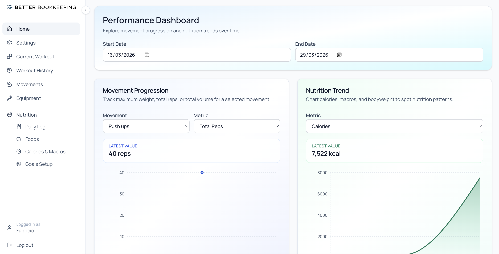
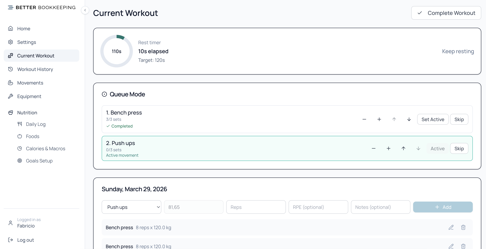
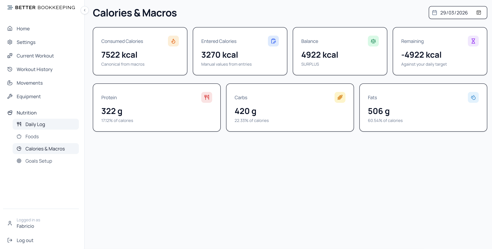

# Super Fit App

A full-stack fitness tracking application built with TanStack Start, Bun, Prisma, and PostgreSQL.

This README describes the current state of the app and the improvements delivered from the original implementation brief.

- Original brief and previous requirements: [docs/original-project-requirements.md](docs/original-project-requirements.md)

## App Screenshots

### Home Dashboard



### Current Workout



### Nutrition Tracking



## Requirements Coverage

This section addresses the original feature requests and stretch goals listed in [docs/original-project-requirements.md](docs/original-project-requirements.md).

### Feature Requests

1. Weight tracking with history charts
   - Implemented. Users can log body weight over time and use progression/insight views to track trends.

2. Better body-weight movement handling
   - Implemented. Movements can be flagged as body-weight, and workout set defaults support body-weight-friendly flows.

3. Workout progression metrics and charting
   - Implemented. Progression features include movement-focused metrics (max weight, reps, volume) over time.

4. End-to-end tests with Playwright
   - Implemented. E2E coverage exists for workouts, sets, movements, nutrition, and equipment.

5. Secure password handling
   - Implemented. Authentication no longer uses plaintext passwords and now stores hashed credentials.

### Stretch Goals

- Nutrition tracking with macros/calories
  - Implemented. Includes calorie/macronutrient workflows, saved foods, daily logs, and nutrition history.

- Database design/performance upgrades
  - Implemented. Prisma schema now includes key indexes, unique constraints, and compound indexes for high-use query paths.

- Security audit and hardening
  - Implemented. Includes CSRF protection, token-based cookie auth, account lockout controls, and stricter validation.

- UI cleanup and polish
  - Implemented. Action icons, improved confirmation flows for dangerous actions, modernized styling decisions, and updated feedback patterns.

## Improvements Implemented

### Features

- Added nutrition tracking to the app
- Added equipment CRUD workflows

### Security

- Uses token-based authentication in cookies
- Added CSRF protection
- Added stronger password validation requirements

### UI

- Added icons to button actions
- Improved UX around delete/archive and file-like destructive flows
- Added icon support for common actions
- Added confirmation dialogs before delete/dangerous actions
- Updated fonts and colors to a more modern visual direction
- Updated the toast/feedback experience

### DevX

- Docker development supports source watch and live update workflows
- Refactored forms to use TanStack Form patterns
- Added separate Docker-based test workflow stages

### Database Design and Performance

- Added missing indexes
- Added missing unique constraints
- Added and corrected compound indexes for common access patterns

### Architectural Improvements

- Added unit tests across core feature/domain areas
- Improved separation of concerns (server, domain, validation, UI)
- Adopted a folder-by-feature strategy
- Improved component separation and reuse boundaries

## Tech Stack

- Framework: TanStack Start (React SSR)
- Router: TanStack Router
- Data Fetching: TanStack Query
- Forms: TanStack Form
- Database: PostgreSQL + Prisma
- Styling: Tailwind CSS v4 + Better Bookkeeping UI
- Runtime/Package Manager: Bun
- Testing: Vitest + Playwright

## Local Development

### Prerequisites

- Bun
- Docker

### Quick Start

```bash
bun install
bun run dev
```

### Common Commands

- `bun run dev` - Start local development stack
- `bun run dev:down` - Stop local Docker services
- `bun run build` - Build production artifacts
- `bun run start` - Start production server
- `bun run typecheck` - Run TypeScript checks
- `bun run test` - Run tests

## Project Structure

```text
src/
  components/      # Shared and feature components
  lib/             # Server functions, domain logic, validation, shared utilities
  routes/          # TanStack Router file-based routes
prisma/
  schema.prisma    # Data model
  migrations/      # Migration history
docs/
  screenshots/     # README screenshot assets
```

## Notes

- For historical context and the original task list, see [docs/original-project-requirements.md](docs/original-project-requirements.md).
